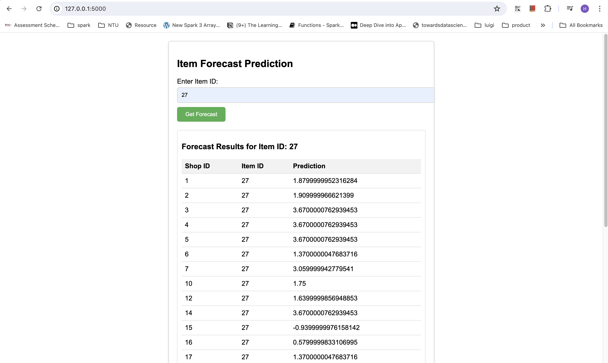

# Task 1: Modeling

## Summary

You are provided with historical sales data on daily basis. You are about to forecast the total amount of products sold in every shop for the test set. Shops and products slightly changes every month.
You will provide your data process, analysis, modeling and evaluation (if any) on single notebook.

# File descriptions

- train.csv - the training set. Reference time from 2013-01 to 2015-10.
- test.csv - the test set. Reference time 2015-11.
- items.csv - list of all items/products.
- item_categories.csv  - list of all categories.
- shops.csv- list of all shops.

## Data fields

- ID - an Id that represents a (Shop, Item) tuple within the test set
- shop_id - unique identifier of a shop
- item_id - unique identifier of a product
- item_category_id - unique identifier of item category
- item_cnt_day - number of products sold. You are predicting a monthly amount of this measure
- item_price - current price of an item
- date - date in format dd/mm/yyyy
- date_block_num - a consecutive month number, used for convenience. 2013-01 is 0, 2013-02 is 1,..., 2015-10 is 33
- item_name - name of item
- shop_name - name of shop
- item_category_name - name of item category

# Taks 2: Deploy this model to internal users.

## Expected customer experience

- User will input in web page a item_id. 
- Web page will return forecast for 2015-11.

## Necessary Input: 

- Deploy this method by your framework of choice.
- Explain some deployment patterns fit to this situation, and your choice to implement.
- Publish your code into Github repository.

